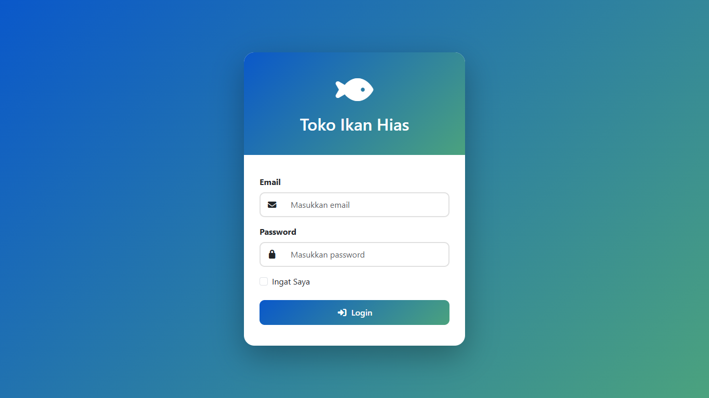
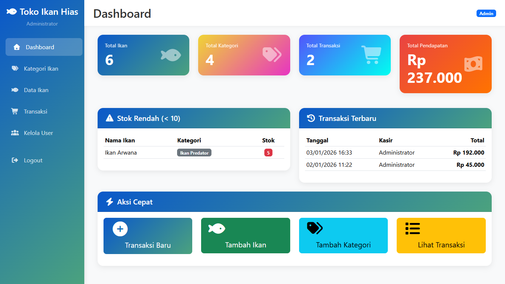
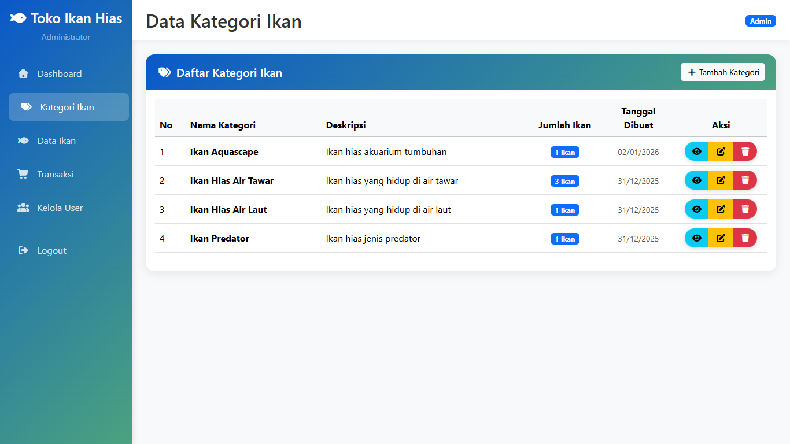
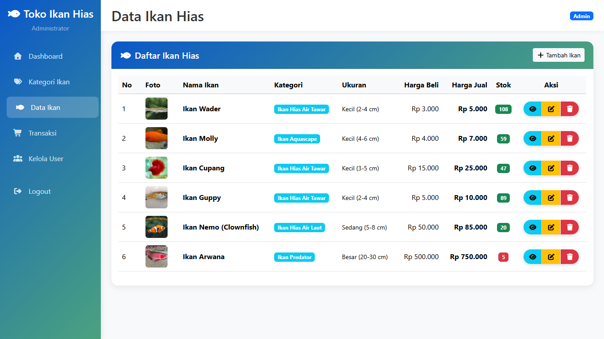
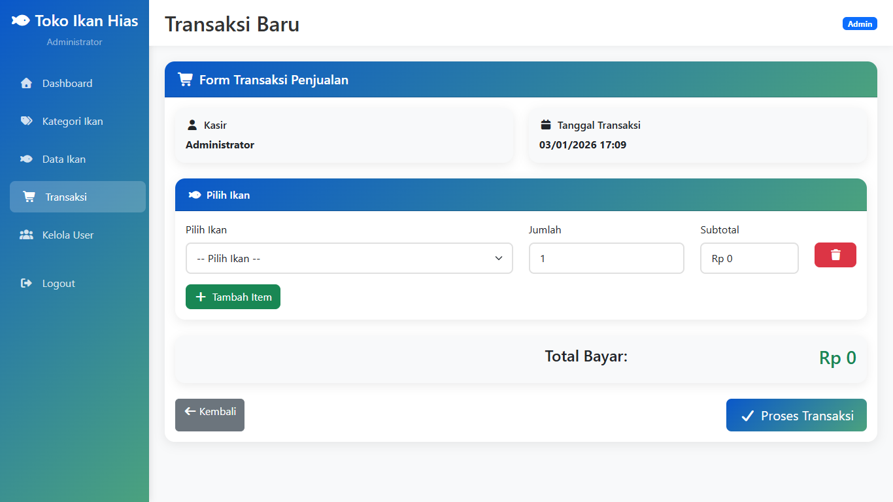
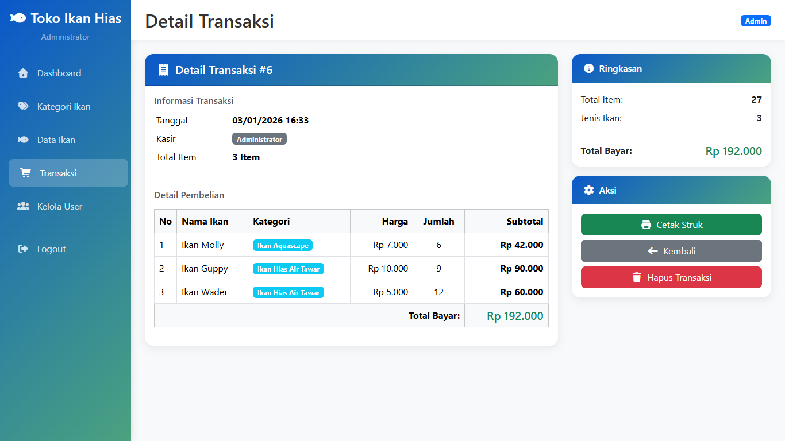

# 🐠 Sistem Informasi Toko Ikan Hias

Sistem Informasi berbasis web untuk mengelola toko ikan hias menggunakan **Laravel 12.x**, **Bootstrap 5**, dan **MySQL**.

---

## 📸 Tampilan Sistem

### Login Page

*Halaman login dengan desain modern gradient*

### Dashboard

*Dashboard dengan statistik real-time dan quick actions*

### Data Kategori Ikan

*Manajemen kategori ikan dengan CRUD lengkap*

### Data Ikan

*Daftar ikan dengan foto, harga, dan stok*

### Form Transaksi (POS)

*Point of Sale dengan keranjang belanja*

### Detail Transaksi

*Detail transaksi lengkap dengan opsi print struk*

---

## 🚀 Fitur Utama

### ✨ Manajemen Data
- ✅ **CRUD Kategori Ikan** - Kelola kategori ikan hias
- ✅ **CRUD Data Ikan** - Kelola data ikan dengan upload foto
- ✅ **CRUD User** - Manajemen user (Admin only)
- ✅ **Manajemen Stok** - Update otomatis saat transaksi

### 💰 Transaksi
- ✅ **Point of Sale (POS)** - Sistem kasir dengan keranjang belanja
- ✅ **Multi Item** - Tambah banyak item dalam satu transaksi
- ✅ **Auto Calculate** - Hitung total otomatis
- ✅ **Print Struk** - Cetak struk transaksi

### 📊 Dashboard & Laporan
- ✅ **Dashboard Statistik** - Total ikan, kategori, transaksi, pendapatan
- ✅ **Alert Stok Rendah** - Notifikasi ikan dengan stok < 10
- ✅ **Riwayat Transaksi** - History transaksi lengkap
- ✅ **Quick Actions** - Akses cepat menu favorit

### 🔐 Keamanan
- ✅ **Authentication** - Login & Logout sistem
- ✅ **Role-Based Access** - Admin & Kasir dengan hak akses berbeda
- ✅ **CSRF Protection** - Keamanan Laravel built-in
- ✅ **Password Hashing** - Bcrypt encryption

### 🎨 User Interface
- ✅ **Responsive Design** - Optimal di desktop, tablet, mobile
- ✅ **Modern UI** - Bootstrap 5 dengan gradient colors
- ✅ **Smooth Animation** - Transisi halus antar elemen
- ✅ **Icon Support** - Font Awesome icons

---

## 📦 Requirements

| Software | Versi Minimum | Recommended |
|----------|---------------|-------------|
| **PHP** | 8.2 | 8.3+ |
| **Composer** | 2.0 | Latest |
| **MySQL** | 5.7 | 8.0+ |
| **Laravel** | 12.x | 12.x |
| **Node.js** | 18.x | 20.x+ (optional) |

---

## 👤 Akun Default

### Admin
- **Email:** `admin@tokoikan.com`
- **Password:** `admin123`
- **Akses:** Semua fitur termasuk manajemen user

### Kasir
- **Email:** `kasir@tokoikan.com`
- **Password:** `kasir123`
- **Akses:** Dashboard, Kategori, Ikan, Transaksi

---

## 👨‍💻 Developer

- **Nama:** Mhd. Akbar
- **Email:** mhdakbar2210@gmail.com
- **GitHub:** [@akbar2025-rgb](https://github.com/username)

---

## 📝 Lisensi

Proyek ini dibuat untuk keperluan pembelajaran dan pengembangan.

---

## 🙏 Credits

- [Laravel](https://laravel.com) - PHP Framework
- [Bootstrap](https://getbootstrap.com) - CSS Framework
- [Font Awesome](https://fontawesome.com) - Icon Library
- [MySQL](https://mysql.com) - Database

---

## 📞 Support

Jika ada pertanyaan atau masalah:
- 📧 Email: mhdakbar2210@gmail.com
- 💬 GitHub Issues: [Create Issue](https://github.com/username/repo/issues)

---

  <strong>⭐ Jika project ini bermanfaat, berikan star ya! ⭐</strong>

